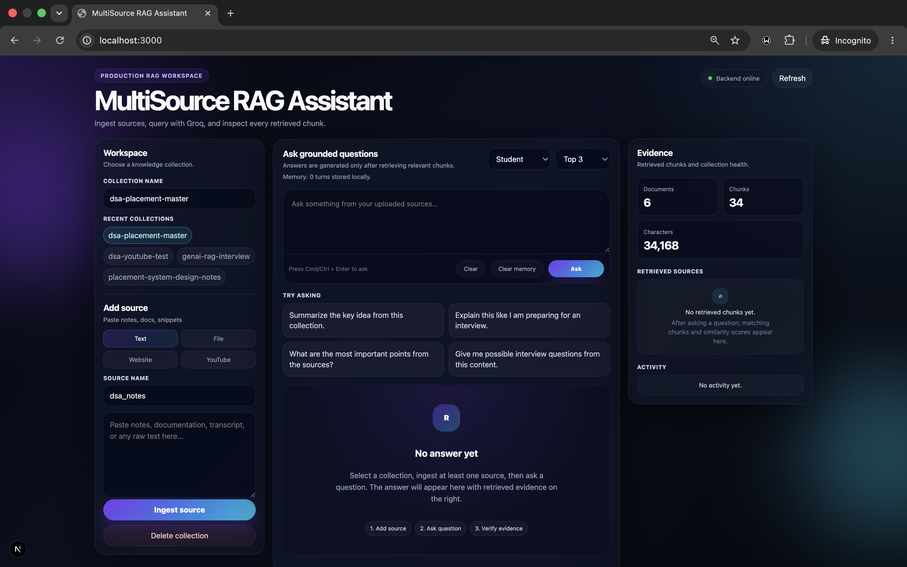
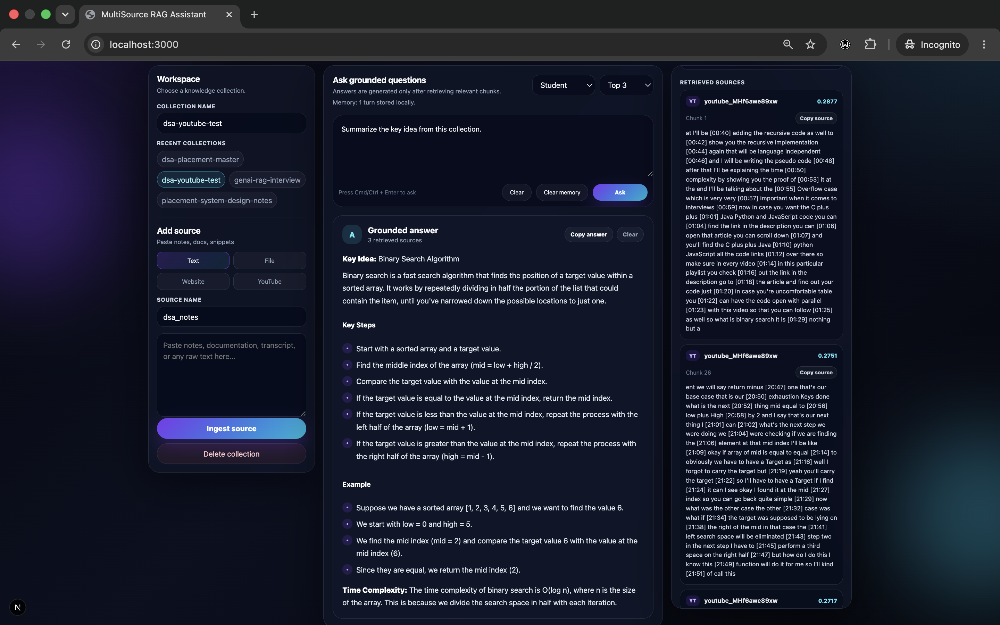

# MultiSource RAG Assistant

A production-style GenAI application that lets users ingest knowledge from multiple source types and ask grounded questions over that knowledge using Retrieval-Augmented Generation.

The system extracts text from user-provided sources, cleans and chunks the content, creates embeddings, stores them in Supabase Postgres with pgvector, retrieves relevant chunks for a user question, and sends the retrieved context to Groq's LLM to generate grounded answers with visible source evidence.

---

## Demo

### Dashboard




### Grounded Answer with Retrieved Sources




---

## Problem Statement

Large Language Models can answer general questions, but they do not automatically know private documents, uploaded notes, latest website content, or user-specific knowledge.

A normal LLM response can also hallucinate because it may generate answers without grounding them in actual source data.

This project solves that problem using Retrieval-Augmented Generation.

Instead of asking the LLM directly, the system first retrieves relevant chunks from a vector database and then gives those chunks to the LLM as context. The final answer is generated from retrieved evidence, and the user can inspect the retrieved source chunks.

---

## Key Features

### Multi-source ingestion

The application supports multiple knowledge sources:

- Raw text notes
- PDF files
- TXT / Markdown files
- DOCX files
- PPTX files
- Website URLs
- YouTube video transcripts

### RAG pipeline

The backend performs the complete RAG workflow:

1. Extract text from source
2. Clean extracted text
3. Split text into chunks
4. Generate embeddings using Sentence Transformers
5. Store chunks, embeddings, and metadata in Supabase Postgres with pgvector
6. Retrieve top-k relevant chunks using vector similarity search
7. Send retrieved context to Groq LLM
8. Generate grounded answer
9. Return answer with retrieved source evidence

### Collection-based workspace

Users can create separate knowledge collections such as:

- `dsa-placement-master`
- `genai-rag-interview`
- `system-design-notes`
- `backend-production-notes`

Each collection has its own sources, chunks, and retrieved evidence.

### Source transparency

The answer includes retrieved sources with:

- Source type
- Source name
- Chunk index
- Similarity score
- Retrieved text chunk

This helps reduce hallucination and makes the answer verifiable.

### Dashboard UI

The frontend includes:

- Modern dashboard layout
- Collection selector
- Source ingestion panel
- Question-answer workspace
- Evidence panel
- Similarity scores
- Short-term local conversation memory per collection
- Clear memory control
- Copy answer button
- Copy source chunk button
- Collection statistics
- Backend health status
- Activity log
- Duplicate source feedback

---

## Tech Stack

### Frontend

- Next.js

### Backend

- FastAPI
- Uvicorn
- Python
- Sentence Transformers
- Groq SDK
- PyMuPDF
- BeautifulSoup
- YouTube Transcript API
- python-docx
- python-pptx
- psycopg

### Database

- Supabase Postgres
- pgvector
- HNSW vector index
- SQL vector similarity search function

### LLM

- Groq API
- Model used: `llama-3.1-8b-instant`

---

## Architecture

```text
User
  ↓
Next.js Frontend
  ↓
FastAPI Backend
  ↓
Source Loaders
  ├── Text Loader
  ├── Document Loader
  ├── Website Loader
  └── YouTube Transcript Loader
  ↓
Text Cleaning
  ↓
Chunking
  ↓
Sentence Transformer Embeddings
  ↓
Supabase Postgres + pgvector
  ↓
Top-k Semantic Retrieval
  ↓
Groq LLM
  ↓
Grounded Answer + Retrieved Sources
```

---

## How the Project Runs

### Frontend

It is responsible for:

- Taking user input
- Managing collections
- Uploading sources
- Sending questions to the backend
- Displaying grounded answers
- Showing retrieved evidence
- Showing collection statistics

### Backend

It is responsible for:

- Handling API requests
- Extracting source text
- Cleaning and chunking text
- Creating embeddings
- Storing vectors in Supabase
- Performing vector search
- Calling Groq API
- Returning grounded answers

### Database

Supabase Postgres with pgvector is used as the persistent vector database.

It stores:

- Collections
- Source documents
- Text chunks
- Embeddings
- Metadata
- Source names
- Source types
- Chunk indexes

### LLM

Groq API is used for fast answer generation.

The LLM receives:

- User question
- User persona
- Retrieved context chunks

The LLM is instructed to answer only from retrieved context and avoid unsupported claims.

---

## Backend API Overview

### Health

```http
GET /health
```

Checks whether the backend and database are working.

### Collections

```http
GET /collections
GET /collections/{collection_name}/stats
DELETE /collections/{collection_name}
```

Used to list collections, view collection statistics, and delete a collection.

### Ingestion

```http
POST /ingest/text
POST /ingest/file
POST /ingest/url
POST /ingest/youtube
```

Used to ingest raw text, documents, websites, and YouTube transcripts.

### Query

```http
POST /query
```

Used to ask a question over a selected collection.

Example response includes:

```json
{
	"answer": "Grounded answer generated from retrieved context.",
	"sources": [
		{
			"source_type": "text",
			"source_name": "dsa_notes",
			"chunk_index": 0,
			"text": "Retrieved source chunk...",
			"score": 0.82
		}
	]
}
```

---

## Database Design

### `rag_documents`

Stores source-level metadata.

Important fields:

- `id`
- `collection_name`
- `source_type`
- `source_name`
- `source_url`
- `content_hash`
- `metadata`
- `created_at`

### `rag_chunks`

Stores chunk-level data and embeddings.

Important fields:

- `id`
- `document_id`
- `collection_name`
- `source_type`
- `source_name`
- `chunk_index`
- `content`
- `char_count`
- `metadata`
- `embedding`
- `created_at`

### `match_rag_chunks`

A SQL function that performs top-k semantic search using pgvector cosine similarity.

---

## Why RAG Instead of Fine-tuning?

RAG is the correct choice for this project because the main requirement is grounded question answering over user-provided sources.

Fine-tuning is useful when we want to change model behavior or teach a task-specific style. But this project needs access to changing documents, notes, websites, and transcripts.

Updating a vector database is simpler, cheaper, and more practical than retraining a model every time the knowledge changes.

---

## Future Improvements

- Add authentication
- Add per-user collections
- Add source-level deletion
- Add background ingestion jobs
- Add streaming answers
- Add OCR support for images
- Add raw audio/video transcription
- Add document preview
- Add retrieval evaluation dashboard
- Add reranking for better retrieval quality
- Add persistent database-backed chat history
- Add export answer as PDF/Markdown
- Add admin dashboard for collection management

---

## Contributions

Contributions, suggestions, and improvements are welcome.

If you find bugs, have ideas for better retrieval quality, or want to improve the UI/UX, feel free to open an issue or submit a pull request.

### Contact

- Email: kumarsidharth333@gmail.com
- GitHub: https://github.com/ksidharth8
